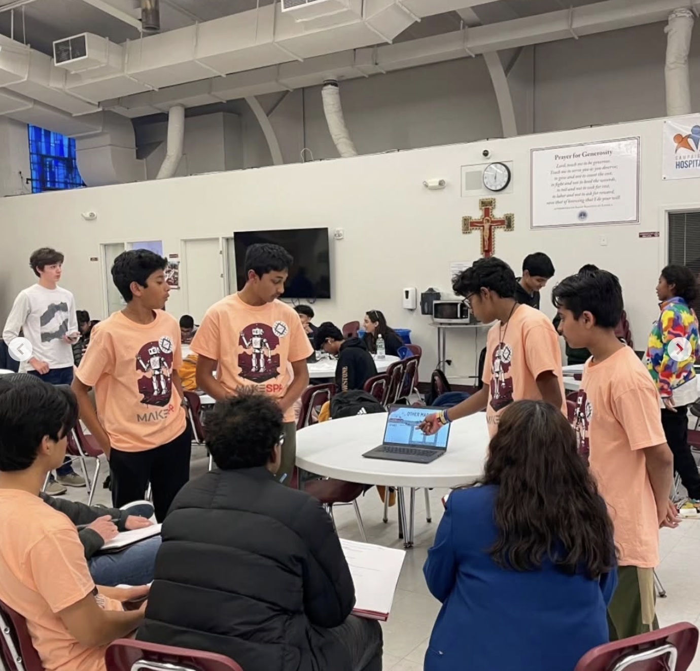

# 🚀 Hackathons

I enjoy participating in hackathons that challenge my creativity and teamwork skills. Here are some of the most impactful ones I’ve attended:

---

## 🧭 HSN Hacks  
**Hosted by:** HSN CS Club & Girls Who Code  
**Team size:** 3

We built an **interactive map** to spread awareness of ICE detention centers across the U.S., integrating real-time data to educate users on location-based impacts.

???+ info "Technologies & Skills"
    - Python, Django Templates, HTML, css
    - Leaflet js
    - Social Impact Awareness Design

---

## 🌱 HackUMBC  
**Team size:** 3  
**GitHub Repo:** [HackUMBC – Carbon Footprint Forum](https://github.com/RajDharkar/HackUMBC)

Created a **carbon footprint calculator and community forum** that allows users to track their emissions and receive suggestions to reduce their impact.

???+ info "Technologies & Skills"
    - Python (Flask)
    - HTML/CSS, Jinja2
    - CSV data processing

---

## 🚑 MakeSPP  
**Team size:** 4  
**GitHub Repo:** [Ambulance Pathfinder](https://github.com/ishaan-cherukuri/ambulance-pathfinder)

Designed an **ambulance pathfinding system** to navigate around traffic blocks and reach destinations on time using a grid-based map and obstacle detection.

{ loading=lazy width="500" }

???+ info "Technologies & Skills"
    - Python (Pathfinding Algorithms)
    - Dijkstra's Algorithm
    - Ipywidgets

---

> Each hackathon helped sharpen my coding skills, teamwork, and ability to think under pressure — all while building real-world solutions with social relevance.
