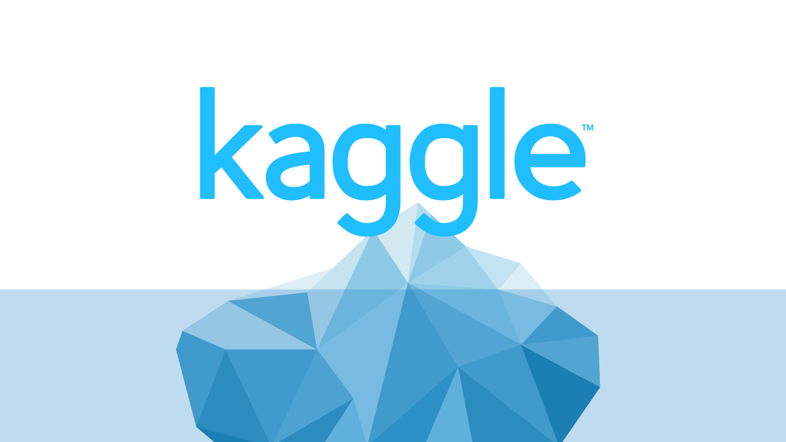

# Kaggle – House Price Regression

I started exploring Kaggle as a way to **improve my machine learning skills** and apply them in real-world competition settings.

---

## House Prices – Advanced Regression Techniques

The first competition I entered was the [House Prices: Advanced Regression Techniques](https://www.kaggle.com/competitions/house-prices-advanced-regression-techniques).  
It is an **indefinite competition** with a live leaderboard, and it became my first opportunity to put my ML knowledge into practice.

{ loading=lazy width="500" }

???+ info "What I Learned"
    - Data preprocessing and feature engineering
    - Applying regression models to structured data
    - Understanding evaluation metrics like RMSE
    - Working with Kaggle notebooks and submissions

---

Though the competition runs indefinitely, it marked an important milestone for me — **my first time applying machine learning skills in a competitive setting**.  

I also wrote an article about this experiance on the **Medium platform**:

👉 <a href="https://medium.com/@ishaan.cherukuri/introduction-fe44f0cea97c" target="_blank" rel="noopener"> Read my Medium Article </a>

