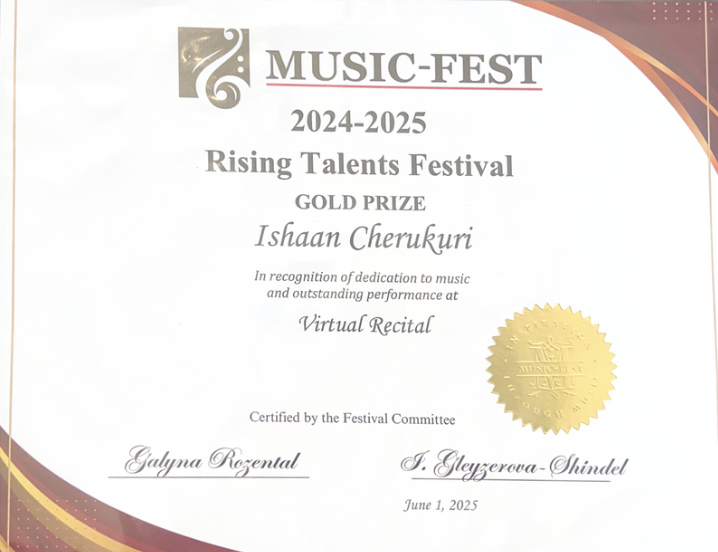

# 🎼 Music

Music has been an important creative outlet for me, especially through the piano. I’ve performed in recitals, competed in festivals, and shared my playing online.

---

## 🎹 Piano Performance

- I have been playing the **piano** for several years.
- Regularly performed at the **Sounds of Music Recital** (2022–2024), organized by **Music-Fest**.

???+ info "Sounds of Music Recital"
    - Annual piano recital by Music-Fest
    - Focuses on classical and contemporary solo performances
    - Participated each year from **2022 to 2024**

---

## 🏅 Rising Talents Festival – **Gold Prize**

In 2025, I auditioned for the **Rising Talents Festival** and was awarded the **Gold Prize**. This recognition allowed me to perform (virtually) at the **National Opera America Center**.

{ loading=lazy width="500" }

???+ info "Festival Highlights"
    - Audition-based international music festival
    - Multiple levels of recognition: Grand Prix, Grand Prize, Gold, Silver
    - Featured at National Opera America Center (virtual)

---

## 📺 Piano YouTube Channel

Check out my performances on my YouTube channel:

👉 [@IshaanCherukuri on YouTube](https://www.youtube.com/@IshaanCherukuri)

> I use my channel to showcase pieces I’ve practiced and performed, and to track my musical progress over time.
